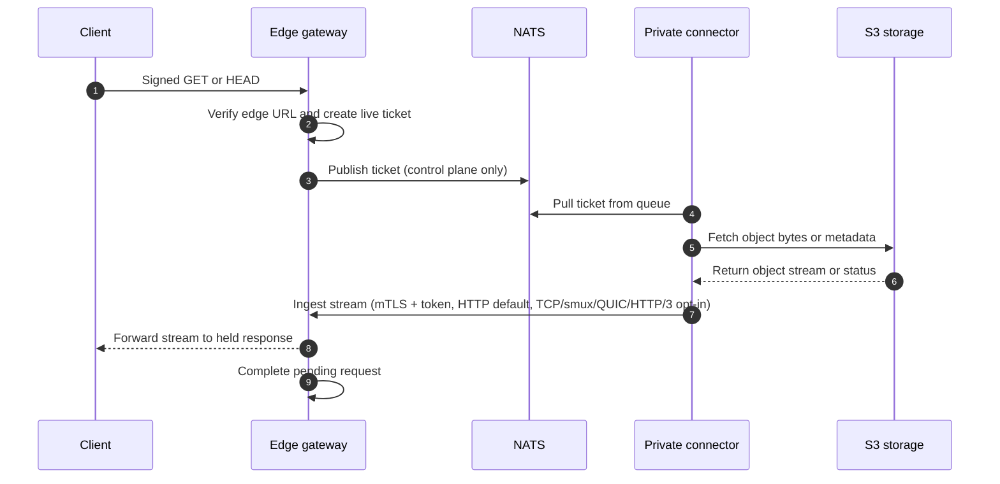
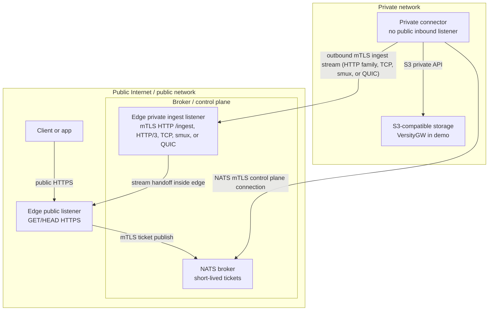

# air3: NATS S3 File Gateway

[](https://www.npmjs.com/package/@terion/air3-edgesign)

**air3** is a secure file gateway that lets you serve files from a strictly private S3-compatible storage to the public internet — or across segmented internal networks — without ever exposing your S3 credentials and server to edge services or opening any inbound firewall ports to your private storage zone. S3 backend can be hidden behind firewall, NAT or even VPN, with no inbound whatsoever, and still can serve public clients without them and edge applications even know of it's existance.

It acts as a secure bridge across network boundaries (like DMZs or zero-trust environments), relying on a NATS message broker to coordinate transfers and strict zone separation to keep your data safe.

## Core Use Cases

### 1. Securely Serving Private Files to the Public Internet

Imagine you have sensitive S3 storage hosted deep within your private infrastructure. You need to let specific public users download certain files via signed URLs.

Normally, you'd have to:
- Generate S3 pre-signed URLs, which grant direct access to your S3 API.
- Open your S3 network to the public internet or put a proxy in a DMZ that holds your highly-privileged S3 credentials.

**air3 solves this by splitting the responsibility:**
1. A **Public Edge Gateway** sits on the public internet. It validates signed URLs from clients but has **zero** knowledge of your S3 credentials and no direct access to S3.
2. A **Private Connector** sits in your private network. It securely holds the S3 credentials but has **no inbound public access**. It only makes outbound connections.
3. A **NATS Broker** acts as a middleman (control plane) passing messages between them.

When a public user requests a file, the Edge Gateway asks the Private Connector (via NATS) to fetch it. The Connector grabs the file from S3 and securely streams it back out to the Edge, which directly delivers it to the user.

### 2. Zero-Trust Internal File Access (Service Mesh / Kubernetes)

air3 isn't just for public-facing traffic. It is equally powerful as an internal bridge in strict zero-trust environments.

If you have isolated Kubernetes clusters, locked-down microservices, or a heavily segmented service mesh, you can deploy the Edge Gateway in the less-trusted zones and the Private Connector in the highly-trusted data zone. This allows your internal services to securely stream objects using short-lived signed URLs without distributing raw S3 credentials to every microservice or punching holes in your storage backbone's network policies.

## Documentation

- [Architecture Details](docs/architecture.md)
- [Configuration Guide](docs/configuration.md)

## How It Works: Request and Stream Flow

- **Control Plane (NATS):** NATS is only used to pass short-lived "fetch tickets" (instructions) from the Edge to the Connector. Object bytes never pass through NATS.
- **Data Plane (HTTPS by default):** File bytes stream directly from your S3 storage to the Private Connector, and then securely out to the Edge Gateway over an outbound mTLS connection. Experimental TCP, smux, custom QUIC, and HTTP/3 ingest transports are available as opt-in benchmark/runtime tuning modes; HTTP remains the default and fallback.
- **No Direct S3 Access:** Users get URLs signed for the Edge Gateway, not S3. The Edge handles authorization before the private network even knows about the request.



## Security and Conceptual Zones

air3 strictly separates your infrastructure into isolated zones:



## System Components

- `cmd/edge-gateway`: The public-facing server. It listens for client `GET`/`HEAD` requests and provides a private mTLS "ingest" listener to receive the file stream from the connector (HTTP by default, with experimental opt-in HTTP/3, TCP, smux, and QUIC).
- `cmd/private-connector`: The private worker. It securely holds S3 credentials, pulls tickets from NATS, fetches the files from S3, and pushes them out to the edge gateway.
- `cmd/signurl`: A CLI utility for generating signed URLs for your Edge Gateway.
- `internal/*`: Core logic for configuration, signing, mTLS, NATS communication, and object fetching.

## Quickstart: Docker Compose Demo

Want to see it in action? The demo spins up a fully separated environment using Docker Compose.

**Prerequisites:**
- Go 1.22+
- `make`
- Docker with Compose plugin
- `openssl` (for demo certificates)
- `curl` (for smoke testing)

The demo creates four isolated services to represent the different network zones:
- `edge-gateway` (Public & Broker networks, exposed on `https://localhost:8443`)
- `private-connector` (Broker & Private networks, completely hidden from the host)
- `nats` (Broker network with mTLS enabled)
- `versitygw` as a mock S3 server (Private network only)

**Run the end-to-end demo:**

```sh
make e2e
```
*(This is a shortcut for `make certs`, `make compose-up`, `make seed`, `make smoke`, and `make compose-down`)*

The smoke tests (`make smoke`) automatically verify that signed `GET`/`HEAD` requests work, expired signatures are rejected, missing objects return `404`, and most importantly, that the Edge container *cannot* bypass the system to connect directly to the private S3 server.

## Performance Benchmarks & Transport Recommendations

We include a comprehensive performance test suite to help you choose the best configuration for your workload. The benchmark spins up the demo stack, seeds sample files (small, medium, and large), and compares **air3's secure gateway** against a direct S3 connection and a standard Caddy reverse proxy.

> **Note:** The benchmarks expose the private S3 server purely for comparison purposes. In normal operation, air3 keeps your S3 storage strictly private.

### Running the Benchmarks Yourself

To run the full suite across different transports (HTTP/1, HTTP/2, HTTP/3, TCP, SMUX, QUIC), concurrency levels, and scale modes:

```sh
make readme-benchmark
```
*Results will be saved in the `.air3-perf-results/` directory.*

### Benchmark Snapshot & Recommendations

The results below show average Time To First Byte (TTFB in ms) / Requests Per Second (RPS) / Throughput (MiB/s).
*(Snapshot generated locally using `make readme-benchmark` on 2026-06-10).*

**Based on these results, we recommend:**

1. **For general use & maximum compatibility:** **`http1`** or **`http2`** remain incredibly solid choices. They are well-understood, easy to debug, and provide strong baseline performance without requiring custom transports.
2. **For large file streaming (highest throughput):** **`tcp`** and **`http1`** perform exceptionally well under high concurrency with large files, often matching or exceeding standard HTTP proxies.
3. **For high-concurrency small files:** **`quic`** and **`http2`** handle many small requests very efficiently.

#### Single Node (1 Gateway, 1 Connector)
*Test environment resource limits:* Caddy `2 CPU`, Edge Gateway `2 CPU`, Private Connector `2 CPU` (1 instance).

*Sequential Requests*
| Target | Small (100KB) | Medium (5MB) | Big (100MB) | Mixed |
|---|---:|---:|---:|---:|
| Caddy proxy (baseline) | 4.5 / 23.8 / 3 | 1.8 / 39.3 / 196 | 1.8 / 19.5 / 889 | 2.5 / 25.4 / 429 |
| **Air3 (http1)** | 6.8 / 9.4 / 1 | 6.1 / 11.0 / 55 | 9.2 / 6.1 / 280 | 7.3 / 7.3 / 124 |
| **Air3 (http2)** | 13.3 / 5.4 / 1 | 15.8 / 5.1 / 25 | 14.9 / 4.5 / 206 | 6.1 / 11.5 / 194 |
| **Air3 (tcp)** | 20.3 / 5.2 / 1 | 20.2 / 5.2 / 26 | 22.3 / 5.3 / 243 | 13.2 / 6.4 / 108 |
| **Air3 (smux)** | 15.4 / 6.6 / 1 | 17.0 / 6.5 / 32 | 18.6 / 5.1 / 231 | 16.2 / 5.8 / 99 |
| **Air3 (quic)** | 9.1 / 7.4 / 1 | 10.7 / 8.5 / 42 | 17.6 / 4.0 / 184 | 10.3 / 10.0 / 170 |
| **Air3 (http3)** | 12.5 / 14.6 / 2 | 12.7 / 10.0 / 50 | 14.4 / 3.7 / 171 | 10.0 / 6.8 / 116 |

*Concurrent Requests (16 workers)*
| Target | Small (100KB) | Medium (5MB) | Big (100MB) | Mixed |
|---|---:|---:|---:|---:|
| Caddy proxy (baseline) | 6.4 / 147.8 / 16 | 20.4 / 138.7 / 690 | 41.9 / 66.4 / 3032 | 22.7 / 114.7 / 1821 |
| **Air3 (http1)** | 13.9 / 61.4 / 6 | 27.7 / 60.0 / 299 | 73.0 / 32.1 / 1466 | 32.5 / 43.9 / 697 |
| **Air3 (http2)** | 11.2 / 64.6 / 7 | 11.9 / 52.1 / 259 | 19.3 / 14.3 / 651 | 15.5 / 32.3 / 513 |
| **Air3 (tcp)** | 20.7 / 63.7 / 7 | 31.0 / 75.1 / 374 | 82.4 / 27.9 / 1276 | 32.0 / 42.4 / 674 |
| **Air3 (smux)** | 19.3 / 67.3 / 7 | 31.5 / 56.1 / 279 | 64.8 / 23.5 / 1072 | 34.0 / 38.7 / 613 |
| **Air3 (quic)** | 20.5 / 72.6 / 8 | 57.0 / 31.5 / 157 | 52.4 / 13.2 / 604 | 26.6 / 27.5 / 437 |
| **Air3 (http3)** | 29.6 / 58.1 / 6 | 42.3 / 26.0 / 130 | 47.4 / 8.6 / 391 | 24.7 / 21.9 / 348 |

#### Scaled (1 Gateway, 3 Connectors)
*Test environment resource limits:* Caddy `4 CPU`, Edge Gateway `4 CPU`, Private Connector `2 CPU` (3 instances, 6 CPU total).

*Sequential Requests*
| Target | Small (100KB) | Medium (5MB) | Big (100MB) | Mixed |
|---|---:|---:|---:|---:|
| Caddy proxy (baseline) | 4.6 / 22.7 / 2 | 2.1 / 27.4 / 136 | 1.7 / 21.3 / 975 | 1.9 / 29.4 / 498 |
| **Air3 (http1)** | 6.5 / 14.3 / 2 | 12.7 / 5.9 / 29 | 9.7 / 6.9 / 316 | 5.0 / 12.9 / 219 |
| **Air3 (http2)** | 12.5 / 7.9 / 1 | 5.9 / 10.1 / 50 | 9.5 / 6.0 / 275 | 8.4 / 5.6 / 95 |
| **Air3 (tcp)** | 15.5 / 6.9 / 1 | 19.7 / 5.4 / 27 | 15.8 / 6.3 / 289 | 15.2 / 6.1 / 104 |
| **Air3 (smux)** | 13.0 / 10.3 / 1 | 24.3 / 6.3 / 31 | 17.0 / 5.4 / 249 | 18.9 / 6.0 / 101 |
| **Air3 (quic)** | 17.8 / 5.7 / 1 | 18.3 / 5.2 / 26 | 9.2 / 6.5 / 298 | 18.9 / 4.6 / 78 |
| **Air3 (http3)** | 8.4 / 11.7 / 1 | 9.8 / 6.3 / 31 | 20.2 / 2.4 / 111 | 19.3 / 4.2 / 71 |

*Concurrent Requests (16 workers)*
| Target | Small (100KB) | Medium (5MB) | Big (100MB) | Mixed |
|---|---:|---:|---:|---:|
| Caddy proxy (baseline) | 5.4 / 169.4 / 18 | 9.5 / 145.3 / 723 | 25.7 / 83.3 / 3805 | 11.9 / 100.0 / 1588 |
| **Air3 (http1)** | 8.2 / 70.7 / 7 | 15.3 / 62.0 / 308 | 44.5 / 35.4 / 1617 | 18.8 / 50.9 / 808 |
| **Air3 (http2)** | 7.8 / 71.5 / 8 | 13.9 / 71.3 / 355 | 11.3 / 29.9 / 1365 | 11.1 / 43.1 / 684 |
| **Air3 (tcp)** | 13.4 / 69.0 / 7 | 22.4 / 70.5 / 351 | 42.3 / 38.8 / 1773 | 41.3 / 42.6 / 676 |
| **Air3 (smux)** | 15.2 / 67.9 / 7 | 25.4 / 57.5 / 286 | 48.4 / 31.1 / 1420 | 22.5 / 44.4 / 704 |
| **Air3 (quic)** | 15.0 / 95.8 / 10 | 16.6 / 41.8 / 208 | 29.7 / 17.7 / 809 | 16.5 / 32.7 / 519 |
| **Air3 (http3)** | 15.1 / 75.8 / 8 | 48.2 / 31.0 / 154 | 22.4 / 13.8 / 629 | 15.5 / 25.4 / 404 |

<details>
<summary><b>Advanced Benchmark Configuration (for developers)</b></summary>

You can deeply customize the benchmark runs via environment variables:

- **Transports:** Set `AIR3_INGEST_TRANSPORT` to `http1`, `http2`, `http3`, `tcp`, `smux`, or `quic`.
- **Concurrency & Scale:** Use `AIR3_PERF_ITERATIONS`, `AIR3_PERF_CONNECTORS`, `AIR3_PERF_MULTI_CONNECTORS`, and `AIR3_PERF_PARALLELISM`.
- **Tuning:** Adjust `AIR3_STREAM_COPY_BUFFER_BYTES`, `AIR3_INGEST_POOL_SIZE`, and `AIR3_CONNECTOR_WORKERS` to see how internal buffering and pooling affects throughput.

Example commands:

```sh
make perf                         # single connector, 5 iterations per object
AIR3_PERF_PARALLELISM=8 make perf # adds a parallel phase
make perf-multi                   # tests scaled mode (3 connectors)
```

The perf override limits each `edge-gateway` and `private-connector` container to one CPU and raises both `AIR3_CONNECTOR_WORKERS` and `AIR3_INGEST_POOL_SIZE` to `1024` unless overridden. It also adds the `caddy-s3` service and `deploy/Caddyfile.perf` for the Caddy baseline. Unsigned public baselines use curl against the perf-exposed endpoints; gateway measurements use `cmd/signurl` and `curl --http1.1 --cacert deploy/certs/generated/dev-ca.crt` against `https://localhost:8443` for stable streaming timings. Custom stream transports (`tcp`, `smux`, `quic`) use the shared MessagePack metadata frame, raw object body, and ack semantics; smux multiplexes those streams over persistent mTLS TCP, one smux stream per object.

</details>

## Generating Signed URLs

To allow users to download files, your backend application must generate an **edge signed URL**. These use a standard HMAC signature. Since the gateway verifies the signature before generating a ticket, bogus requests are dropped at the edge—saving your private network from dealing with malicious traffic.

We provide drop-in packages for Go, TypeScript, and Python under the `packages/` directory. The TypeScript package is published to the public npm registry as `@terion/air3-edgesign`:

```sh
npm install @terion/air3-edgesign
```

### Go Example

```go
raw, err := edgesign.SignURL(edgesign.SignInput{
    Method:  "GET",
    BaseURL: "https://files.example.com",
    Bucket:  "demo-bucket",
    Key:     "dir/object.txt",
    Secret:  signingSecret,
    Expires: time.Now().Add(15 * time.Minute),
    Range:   "bytes=0-99", // optional
})
```

### TypeScript Example

```ts
import { signUrl, verifyUrl } from '@terion/air3-edgesign';

const raw = signUrl({
  method: 'GET',
  baseUrl: 'https://files.example.com',
  bucket: 'demo-bucket',
  key: 'dir/object.txt',
  secret: signingSecret,
  expires: Math.floor(Date.now() / 1000) + 900,
  range: 'bytes=0-99', // optional
});
```

### Python Example

```python
from datetime import datetime, timedelta, timezone
from edgesign import sign_url, verify_url

raw = sign_url(
    method="GET",
    base_url="https://files.example.com",
    bucket="demo-bucket",
    key="dir/object.txt",
    secret=signing_secret,
    expires=datetime.now(timezone.utc) + timedelta(minutes=15),
    range="bytes=0-99",  # optional
)
```

## HTTP Range Requests

If you need to serve partial files (like for streaming video), `air3` fully supports standard HTTP `Range` headers.

If you're using signed URLs and expect clients to send `Range` headers, you must include the exact range claim when generating the URL (e.g., `cmd/signurl -range 'bytes=0-99'`). The Connector forwards authorized ranges to S3, seamlessly returning a `206 Partial Content` response to the client.

## Local Development & Validation

```sh
make validate        # format, test, build, and check compose config
make fmt             # format Go code
make test            # run Go tests
make build           # build binaries into ./bin
make ts-test         # install, test, and build the TypeScript package
make python-test     # run Python package tests
go test ./... -race  # run race-enabled Go tests
```

## Releases & Docker Images

We publish multi-architecture Docker images (Linux on `amd64` and `arm64`) to the GitHub Container Registry on every release. Cross-compiled binaries for macOS, Windows, and Linux are also attached to GitHub releases. The same tag workflow publishes the public npm package `@terion/air3-edgesign` to npmjs with the tag as the npm version. Publishing uses npm Trusted Publishing from `.github/workflows/release.yml`, so the GitHub Actions job authenticates to npm through OIDC instead of an npm token.

- `ghcr.io/terion-name/air3/edge-gateway:<tag>`
- `ghcr.io/terion-name/air3/private-connector:<tag>`
- `ghcr.io/terion-name/air3/signurl:<tag>`

You can build local images using the root `Dockerfile` by setting the `APP` argument:
```sh
docker build --build-arg APP=edge-gateway -t air3-edge-gateway:local .
docker build --build-arg APP=private-connector -t air3-private-connector:local .
docker build --build-arg APP=signurl -t air3-signurl:local .
```
