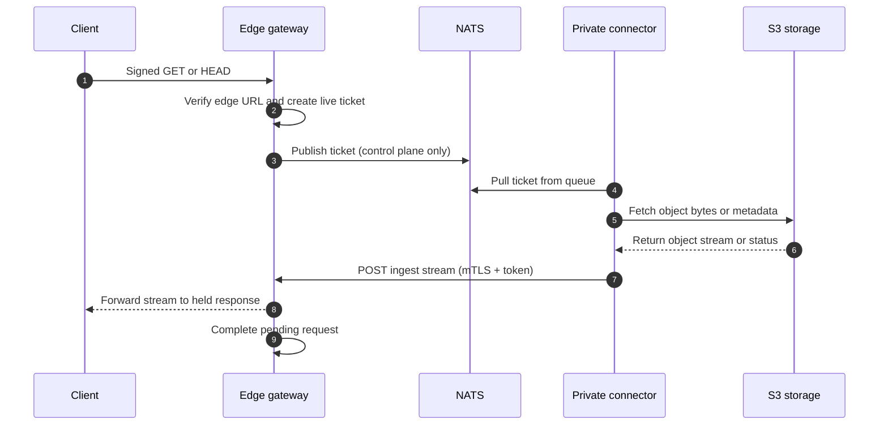
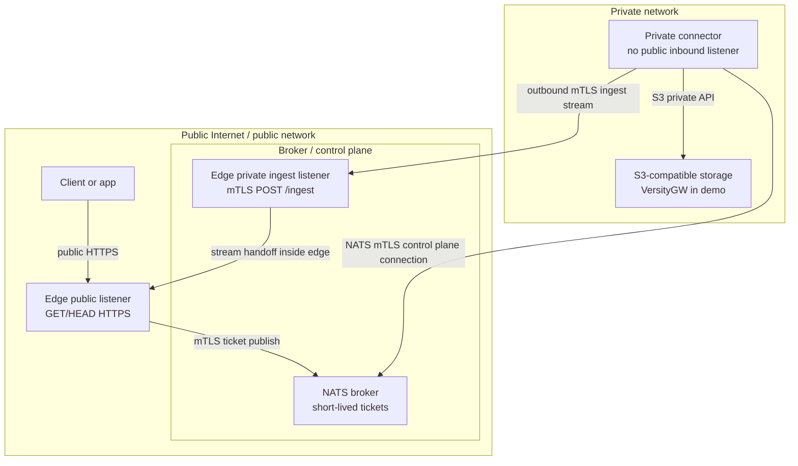

# air3: NATS S3 File Gateway

**air3** is a secure file gateway that lets you serve files from a strictly private S3-compatible storage to the public internet—without ever exposing your S3 credentials to public-facing servers or opening any inbound firewall ports to your private network.

It acts as a bridge between the wild public internet and your highly secure private network, relying on a NATS message broker to coordinate transfers and strict zone separation to keep your data safe.

## The Usecase: Securely Serving Private Files

Imagine you have sensitive S3 storage hosted deep within your private infrastructure. You need to let specific public users download certain files via signed URLs.

Normally, you'd have to:
- Generate S3 pre-signed URLs, which grant direct access to your S3 API.
- Open your S3 network to the public internet or put a proxy in a DMZ that holds your highly-privileged S3 credentials.

**air3 solves this by splitting the responsibility:**
1. A **Public Edge Gateway** sits on the public internet. It validates signed URLs from clients but has **zero** knowledge of your S3 credentials and no direct access to S3.
2. A **Private Connector** sits in your private network. It securely holds the S3 credentials but has **no inbound public access**. It only makes outbound connections.
3. A **NATS Broker** acts as a middleman (control plane) passing messages between them.

When a public user requests a file, the Edge Gateway asks the Private Connector (via NATS) to fetch it. The Connector grabs the file from S3 and securely streams it back out to the Edge, which directly delivers it to the user.

## Documentation

- [Architecture Details](docs/architecture.md)
- [Configuration Guide](docs/configuration.md)

## How It Works: Request and Stream Flow

- **Control Plane (NATS):** NATS is only used to pass short-lived "fetch tickets" (instructions) from the Edge to the Connector. Object bytes never pass through NATS.
- **Data Plane (HTTPS):** File bytes stream directly from your S3 storage to the Private Connector, and then securely out to the Edge Gateway over an outbound mTLS connection.
- **No Direct S3 Access:** Users get URLs signed for the Edge Gateway, not S3. The Edge handles authorization before the private network even knows about the request.



## Security and Conceptual Zones

air3 strictly separates your infrastructure into isolated zones:



## System Components

- `cmd/edge-gateway`: The public-facing server. It listens for client `GET`/`HEAD` requests and provides a private mTLS "ingest" listener to receive the file stream from the connector.
- `cmd/private-connector`: The private worker. It securely holds S3 credentials, pulls tickets from NATS, fetches the files from S3, and pushes them out to the edge gateway.
- `cmd/signurl`: A CLI utility for generating signed URLs for your Edge Gateway.
- `internal/*`: Core logic for configuration, signing, mTLS, NATS communication, and object fetching.

## Quickstart: Docker Compose Demo

Want to see it in action? The demo spins up a fully separated environment using Docker Compose.

**Prerequisites:**
- Go 1.22+
- `make`
- Docker with Compose plugin
- `openssl` (for demo certificates)
- `curl` (for smoke testing)

The demo creates four isolated services to represent the different network zones:
- `edge-gateway` (Public & Broker networks, exposed on `https://localhost:8443`)
- `private-connector` (Broker & Private networks, completely hidden from the host)
- `nats` (Broker network with mTLS enabled)
- `versitygw` as a mock S3 server (Private network only)

**Run the end-to-end demo:**

```sh
make e2e
```
*(This is a shortcut for `make certs`, `make compose-up`, `make seed`, `make smoke`, and `make compose-down`)*

The smoke tests (`make smoke`) automatically verify that signed `GET`/`HEAD` requests work, expired signatures are rejected, missing objects return `404`, and most importantly, that the Edge container *cannot* bypass the system to connect directly to the private S3 server.

## Generating Signed URLs

To allow users to download files, your backend application must generate an **edge signed URL**. These use a standard HMAC signature. Since the gateway verifies the signature before generating a ticket, bogus requests are dropped at the edge—saving your private network from dealing with malicious traffic.

We provide drop-in packages for Go, TypeScript, and Python under the `packages/` directory. The TypeScript package is published to the public npm registry as `@terion/air3-edgesign`:

```sh
npm install @terion/air3-edgesign
```

### Go Example

```go
raw, err := edgesign.SignURL(edgesign.SignInput{
    Method:  "GET",
    BaseURL: "https://files.example.com",
    Bucket:  "demo-bucket",
    Key:     "dir/object.txt",
    Secret:  signingSecret,
    Expires: time.Now().Add(15 * time.Minute),
    Range:   "bytes=0-99", // optional
})
```

### TypeScript Example

```ts
import { signUrl, verifyUrl } from '@terion/air3-edgesign';

const raw = signUrl({
  method: 'GET',
  baseUrl: 'https://files.example.com',
  bucket: 'demo-bucket',
  key: 'dir/object.txt',
  secret: signingSecret,
  expires: Math.floor(Date.now() / 1000) + 900,
  range: 'bytes=0-99', // optional
});
```

### Python Example

```python
from datetime import datetime, timedelta, timezone
from edgesign import sign_url, verify_url

raw = sign_url(
    method="GET",
    base_url="https://files.example.com",
    bucket="demo-bucket",
    key="dir/object.txt",
    secret=signing_secret,
    expires=datetime.now(timezone.utc) + timedelta(minutes=15),
    range="bytes=0-99",  # optional
)
```

## HTTP Range Requests

If you need to serve partial files (like for streaming video), `air3` fully supports standard HTTP `Range` headers.

If you're using signed URLs and expect clients to send `Range` headers, you must include the exact range claim when generating the URL (e.g., `cmd/signurl -range 'bytes=0-99'`). The Connector forwards authorized ranges to S3, seamlessly returning a `206 Partial Content` response to the client.

## Local Development & Validation

```sh
make validate        # format, test, build, and check compose config
make fmt             # format Go code
make test            # run Go tests
make build           # build binaries into ./bin
make ts-test         # install, test, and build the TypeScript package
make python-test     # run Python package tests
go test ./... -race  # run race-enabled Go tests
```

## Releases & Docker Images

We publish multi-architecture Docker images (Linux on `amd64` and `arm64`) to the GitHub Container Registry on every release. Cross-compiled binaries for macOS, Windows, and Linux are also attached to GitHub releases. The same tag workflow publishes the public npm package `@terion/air3-edgesign` to npmjs with the tag as the npm version. Publishing uses npm Trusted Publishing from `.github/workflows/release.yml`, so the GitHub Actions job authenticates to npm through OIDC instead of an npm token.

- `ghcr.io/terion-name/air3/edge-gateway:<tag>`
- `ghcr.io/terion-name/air3/private-connector:<tag>`
- `ghcr.io/terion-name/air3/signurl:<tag>`

You can build local images using the root `Dockerfile` by setting the `APP` argument:
```sh
docker build --build-arg APP=edge-gateway -t air3-edge-gateway:local .
docker build --build-arg APP=private-connector -t air3-private-connector:local .
docker build --build-arg APP=signurl -t air3-signurl:local .
```
