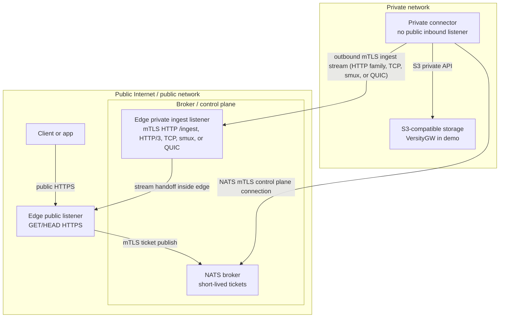

# air3: NATS S3 File Gateway

**air3** is a secure file gateway that lets you serve files from a strictly private S3-compatible storage to the public internet—without ever exposing your S3 credentials to public-facing servers or opening any inbound firewall ports to your private network.

It acts as a bridge between the wild public internet and your highly secure private network, relying on a NATS message broker to coordinate transfers and strict zone separation to keep your data safe.

## The Usecase: Securely Serving Private Files

Imagine you have sensitive S3 storage hosted deep within your private infrastructure. You need to let specific public users download certain files via signed URLs.

Normally, you'd have to:
- Generate S3 pre-signed URLs, which grant direct access to your S3 API.
- Open your S3 network to the public internet or put a proxy in a DMZ that holds your highly-privileged S3 credentials.

**air3 solves this by splitting the responsibility:**
1. A **Public Edge Gateway** sits on the public internet. It validates signed URLs from clients but has **zero** knowledge of your S3 credentials and no direct access to S3.
2. A **Private Connector** sits in your private network. It securely holds the S3 credentials but has **no inbound public access**. It only makes outbound connections.
3. A **NATS Broker** acts as a middleman (control plane) passing messages between them.

When a public user requests a file, the Edge Gateway asks the Private Connector (via NATS) to fetch it. The Connector grabs the file from S3 and securely streams it back out to the Edge, which directly delivers it to the user.

## Documentation

- [Architecture Details](docs/architecture.md)
- [Configuration Guide](docs/configuration.md)

## How It Works: Request and Stream Flow

- **Control Plane (NATS):** NATS is only used to pass short-lived "fetch tickets" (instructions) from the Edge to the Connector. Object bytes never pass through NATS.
- **Data Plane (HTTPS by default):** File bytes stream directly from your S3 storage to the Private Connector, and then securely out to the Edge Gateway over an outbound mTLS connection. Experimental TCP, smux, custom QUIC, and HTTP/3 ingest transports are available as opt-in benchmark/runtime tuning modes; HTTP remains the default and fallback.
- **No Direct S3 Access:** Users get URLs signed for the Edge Gateway, not S3. The Edge handles authorization before the private network even knows about the request.

```mermaid
sequenceDiagram
    autonumber
    participant Client
    participant Edge as Edge gateway
    participant NATS as NATS
    participant Connector as Private connector
    participant S3 as S3 storage

    Client->>Edge: Signed GET or HEAD
    Edge->>Edge: Verify edge URL and create live ticket
    Edge->>NATS: Publish ticket (control plane only)
    Connector->>NATS: Pull ticket from queue
    Connector->>S3: Fetch object bytes or metadata
    S3-->>Connector: Return object stream or status
    Connector->>Edge: Ingest stream (mTLS + token; HTTP default, TCP/smux/QUIC/HTTP/3 opt-in)
    Edge-->>Client: Forward stream to held response
    Edge->>Edge: Complete pending request
```

## Security and Conceptual Zones

air3 strictly separates your infrastructure into isolated zones:



## System Components

- `cmd/edge-gateway`: The public-facing server. It listens for client `GET`/`HEAD` requests and provides a private mTLS "ingest" listener to receive the file stream from the connector (HTTP by default, with experimental opt-in HTTP/3, TCP, smux, and QUIC).
- `cmd/private-connector`: The private worker. It securely holds S3 credentials, pulls tickets from NATS, fetches the files from S3, and pushes them out to the edge gateway.
- `cmd/signurl`: A CLI utility for generating signed URLs for your Edge Gateway.
- `internal/*`: Core logic for configuration, signing, mTLS, NATS communication, and object fetching.

## Quickstart: Docker Compose Demo

Want to see it in action? The demo spins up a fully separated environment using Docker Compose.

**Prerequisites:**
- Go 1.22+
- `make`
- Docker with Compose plugin
- `openssl` (for demo certificates)
- `curl` (for smoke testing)

The demo creates four isolated services to represent the different network zones:
- `edge-gateway` (Public & Broker networks, exposed on `https://localhost:8443`)
- `private-connector` (Broker & Private networks, completely hidden from the host)
- `nats` (Broker network with mTLS enabled)
- `versitygw` as a mock S3 server (Private network only)

**Run the end-to-end demo:**

```sh
make e2e
```
*(This is a shortcut for `make certs`, `make compose-up`, `make seed`, `make smoke`, and `make compose-down`)*

The smoke tests (`make smoke`) automatically verify that signed `GET`/`HEAD` requests work, expired signatures are rejected, missing objects return `404`, and most importantly, that the Edge container *cannot* bypass the system to connect directly to the private S3 server.

## Compose Performance Test

The Compose benchmark starts the demo stack with a performance override, exposes perf-only public read baselines, seeds three Wikimedia objects into the demo bucket, and compares those baselines against signed air3 gateway-through downloads. The reported paths are:

- `direct_s3`: unsigned public read directly from host-exposed VersityGW.
- `caddy_s3`: unsigned public read through stock `caddy:2-alpine` reverse proxy with `cpus: 1.0`.
- `air3_gateway`: signed Air3 gateway URL through normal edge/private-connector path.

These public reads are perf/demo-only. The normal Compose security topology remains unchanged: outside the perf override, VersityGW stays private and the edge still cannot bypass the connector path.

```sh
make perf                         # one private connector, 5 iterations per object
AIR3_PERF_ITERATIONS=1 AIR3_PERF_SKIP_BIG=1 make perf
make perf-multi                   # AIR3_PERF_MULTI_CONNECTORS private connectors (default: 3)
AIR3_PERF_PARALLELISM=8 make perf # optional parallel gateway-through phase
AIR3_INGEST_TRANSPORT=http1 AIR3_PERF_ITERATIONS=1 AIR3_PERF_SKIP_BIG=1 AIR3_PERF_CONNECTORS=1 ./deploy/scripts/perf-compose.sh
AIR3_INGEST_TRANSPORT=http2 AIR3_PERF_ITERATIONS=1 AIR3_PERF_SKIP_BIG=1 AIR3_PERF_CONNECTORS=1 ./deploy/scripts/perf-compose.sh
AIR3_INGEST_TRANSPORT=tcp AIR3_PERF_ITERATIONS=1 AIR3_PERF_SKIP_BIG=1 AIR3_PERF_CONNECTORS=1 ./deploy/scripts/perf-compose.sh
AIR3_INGEST_TRANSPORT=smux AIR3_PERF_ITERATIONS=1 AIR3_PERF_SKIP_BIG=1 AIR3_PERF_CONNECTORS=1 ./deploy/scripts/perf-compose.sh
AIR3_INGEST_TRANSPORT=quic AIR3_PERF_ITERATIONS=1 AIR3_PERF_SKIP_BIG=1 AIR3_PERF_CONNECTORS=1 ./deploy/scripts/perf-compose.sh
AIR3_INGEST_TRANSPORT=http3 AIR3_PERF_ITERATIONS=1 AIR3_PERF_SKIP_BIG=1 AIR3_PERF_CONNECTORS=1 ./deploy/scripts/perf-compose.sh
```

Results are written under `.air3-perf-results/` as per-request CSV plus a summary CSV with average latency, speed, throughput, and penalty percentages for `direct_s3`, `caddy_s3`, and `air3_gateway`. Default result filenames include the transport label, and the CSVs include an `ingest_transport` column so explicit HTTP variants, legacy HTTP, and experimental TCP/smux/quic runs are distinguishable. Downloaded source files are cached under `.air3-perf-cache/` so repeat runs do not re-download them.

### README Benchmark Harness

For the broader README comparison matrix, run:

```sh
make readme-benchmark
```

That harness compares the Caddy baseline with Air3 over all ingest transports (`http1`, `http2`, `tcp`, `smux`, `quic`, and `http3`) across single and scaled Compose modes, sequential and 16-way concurrent traffic, and small/medium/big/mixed content sets. It writes `raw.csv`, `aggregate.csv`, and `summary.md` under `.air3-perf-results/readme-*`.

### Performance Snapshot

The following snapshot comes from `.air3-perf-results/readme-20260610-151107`, generated on 2026-06-10 with the README benchmark harness. It is a local Docker Compose comparison using hot object-store/cache data, intended for relative Caddy-vs-Air3 transport analysis rather than a cloud SLA or production capacity claim.

Scale modes:

- **single:** Caddy 2 CPU, edge-gateway 2 CPU, 1 private connector with 2 CPU.
- **scaled:** Caddy 4 CPU, edge-gateway 4 CPU, 3 private connectors with 2 CPU each.

Cells are `avg TTFB ms / RPS / MiB/s`, with sequential runs using one request at a time and concurrent runs using 16 requests at concurrency 16.

#### Single sequential

| Target | Small | Medium | Big | Mixed |
|---|---:|---:|---:|---:|
| Caddy baseline | 4.5 / 23.8 / 3 | 1.8 / 39.3 / 196 | 1.8 / 19.5 / 889 | 2.5 / 25.4 / 429 |
| Air3 http1 | 6.8 / 9.4 / 1 | 6.1 / 11.0 / 55 | 9.2 / 6.1 / 280 | 7.3 / 7.3 / 124 |
| Air3 http2 | 13.3 / 5.4 / 1 | 15.8 / 5.1 / 25 | 14.9 / 4.5 / 206 | 6.1 / 11.5 / 194 |
| Air3 tcp | 20.3 / 5.2 / 1 | 20.2 / 5.2 / 26 | 22.3 / 5.3 / 243 | 13.2 / 6.4 / 108 |
| Air3 smux | 15.4 / 6.6 / 1 | 17.0 / 6.5 / 32 | 18.6 / 5.1 / 231 | 16.2 / 5.8 / 99 |
| Air3 quic | 9.1 / 7.4 / 1 | 10.7 / 8.5 / 42 | 17.6 / 4.0 / 184 | 10.3 / 10.0 / 170 |
| Air3 http3 | 12.5 / 14.6 / 2 | 12.7 / 10.0 / 50 | 14.4 / 3.7 / 171 | 10.0 / 6.8 / 116 |

#### Single concurrent

| Target | Small | Medium | Big | Mixed |
|---|---:|---:|---:|---:|
| Caddy baseline | 6.4 / 147.8 / 16 | 20.4 / 138.7 / 690 | 41.9 / 66.4 / 3032 | 22.7 / 114.7 / 1821 |
| Air3 http1 | 13.9 / 61.4 / 6 | 27.7 / 60.0 / 299 | 73.0 / 32.1 / 1466 | 32.5 / 43.9 / 697 |
| Air3 http2 | 11.2 / 64.6 / 7 | 11.9 / 52.1 / 259 | 19.3 / 14.3 / 651 | 15.5 / 32.3 / 513 |
| Air3 tcp | 20.7 / 63.7 / 7 | 31.0 / 75.1 / 374 | 82.4 / 27.9 / 1276 | 32.0 / 42.4 / 674 |
| Air3 smux | 19.3 / 67.3 / 7 | 31.5 / 56.1 / 279 | 64.8 / 23.5 / 1072 | 34.0 / 38.7 / 613 |
| Air3 quic | 20.5 / 72.6 / 8 | 57.0 / 31.5 / 157 | 52.4 / 13.2 / 604 | 26.6 / 27.5 / 437 |
| Air3 http3 | 29.6 / 58.1 / 6 | 42.3 / 26.0 / 130 | 47.4 / 8.6 / 391 | 24.7 / 21.9 / 348 |

#### Scaled sequential

| Target | Small | Medium | Big | Mixed |
|---|---:|---:|---:|---:|
| Caddy baseline | 4.6 / 22.7 / 2 | 2.1 / 27.4 / 136 | 1.7 / 21.3 / 975 | 1.9 / 29.4 / 498 |
| Air3 http1 | 6.5 / 14.3 / 2 | 12.7 / 5.9 / 29 | 9.7 / 6.9 / 316 | 5.0 / 12.9 / 219 |
| Air3 http2 | 12.5 / 7.9 / 1 | 5.9 / 10.1 / 50 | 9.5 / 6.0 / 275 | 8.4 / 5.6 / 95 |
| Air3 tcp | 15.5 / 6.9 / 1 | 19.7 / 5.4 / 27 | 15.8 / 6.3 / 289 | 15.2 / 6.1 / 104 |
| Air3 smux | 13.0 / 10.3 / 1 | 24.3 / 6.3 / 31 | 17.0 / 5.4 / 249 | 18.9 / 6.0 / 101 |
| Air3 quic | 17.8 / 5.7 / 1 | 18.3 / 5.2 / 26 | 9.2 / 6.5 / 298 | 18.9 / 4.6 / 78 |
| Air3 http3 | 8.4 / 11.7 / 1 | 9.8 / 6.3 / 31 | 20.2 / 2.4 / 111 | 19.3 / 4.2 / 71 |

#### Scaled concurrent

| Target | Small | Medium | Big | Mixed |
|---|---:|---:|---:|---:|
| Caddy baseline | 5.4 / 169.4 / 18 | 9.5 / 145.3 / 723 | 25.7 / 83.3 / 3805 | 11.9 / 100.0 / 1588 |
| Air3 http1 | 8.2 / 70.7 / 7 | 15.3 / 62.0 / 308 | 44.5 / 35.4 / 1617 | 18.8 / 50.9 / 808 |
| Air3 http2 | 7.8 / 71.5 / 8 | 13.9 / 71.3 / 355 | 11.3 / 29.9 / 1365 | 11.1 / 43.1 / 684 |
| Air3 tcp | 13.4 / 69.0 / 7 | 22.4 / 70.5 / 351 | 42.3 / 38.8 / 1773 | 41.3 / 42.6 / 676 |
| Air3 smux | 15.2 / 67.9 / 7 | 25.4 / 57.5 / 286 | 48.4 / 31.1 / 1420 | 22.5 / 44.4 / 704 |
| Air3 quic | 15.0 / 95.8 / 10 | 16.6 / 41.8 / 208 | 29.7 / 17.7 / 809 | 16.5 / 32.7 / 519 |
| Air3 http3 | 15.1 / 75.8 / 8 | 48.2 / 31.0 / 154 | 22.4 / 13.8 / 629 | 15.5 / 25.4 / 404 |

Useful knobs:

- `AIR3_PERF_ITERATIONS` (default `5`)
- `AIR3_PERF_CONNECTORS` (default `1`)
- `AIR3_PERF_MULTI_CONNECTORS` (default `3`, used by `make perf-multi`)
- `AIR3_PERF_PARALLELISM` for the optional parallel gateway-through phase
- `AIR3_PERF_SKIP_BIG=1` to skip the video object for a quick run
- `AIR3_PERF_S3_PORT` to change the temporary localhost VersityGW port
- `AIR3_PERF_CADDY_PORT` to change the temporary localhost Caddy baseline port
- `AIR3_PERF_CADDY_BASE_URL` to point the `caddy_s3` baseline at a different proxy URL
- `AIR3_PERF_PUBLIC_READ_MODE` controls how the perf script enables anonymous reads: ACL mode sets a public-read bucket ACL in VersityGW; `auto` falls back to a bucket policy if ACL-only anonymous reads are not sufficient.
- `AIR3_STREAM_COPY_BUFFER_BYTES` (default `262144`) tunes the Edge streaming copy buffer size for Compose perf runs.
- `AIR3_INGEST_POOL_SIZE` (normal default `32`, perf default `1024`) caps reusable connector-side connection/session/client pools for HTTP-family, smux, QUIC, and HTTP/3 ingest transports; raw TCP remains one connection per object.
- `AIR3_CONNECTOR_WORKERS` (normal default `1`, perf default `1024`) bounds concurrent ticket handling inside each private connector.
- `AIR3_INGEST_TRANSPORT=http|http1|http2|http3|tcp|smux|quic` selects the connector→edge ingest transport. Legacy `http` remains the default for compatibility; `http1` forces connector HTTP/1.1, `http2` enables connector HTTP/2, and `http3` uses HTTP/3. The HTTP family uses `AIR3_INGEST_URL`, existing ingest headers, and the object body. `tcp`, `smux`, and `quic` are custom stream transports that use a shared MessagePack metadata frame, raw object body, and ack semantics. Compose keeps the TCP/smux and QUIC ingest listeners internal by default.
- `AIR3_INGEST_DISABLE_HTTP2` (default `false`) is legacy/compatibility-only for `AIR3_INGEST_TRANSPORT=http` (`true` = HTTP/1.1, `false` = HTTP/2). Explicit `http1`, `http2`, and `http3` ignore it.
- `AIR3_EDGE_INGEST_TCP_ADDR` (Compose default `:9444`) controls the edge TCP/smux ingest listener when `tcp` or `smux` transport is enabled.
- `AIR3_INGEST_TCP_ADDR` (Compose default `edge-gateway:9444`) controls the connector TCP/smux dial address when `tcp` or `smux` transport is enabled. `smux` reuses these TCP address variables.
- `AIR3_EDGE_INGEST_QUIC_ADDR` (Compose default `:9445`) controls the edge QUIC ingest listener when `quic` transport is enabled. Compose does not publish this UDP listener to the host by default; host exposure requires an explicit `/udp` port mapping.
- `AIR3_INGEST_QUIC_ADDR` (Compose default `edge-gateway:9445`) controls the connector QUIC dial address when `quic` transport is enabled. `AIR3_INGEST_URL` remains the HTTPS ingest fallback/ticket URL in all transport modes and is used directly by the HTTP-family transports.
- `AIR3_PERF_CACHE_DIR` and `AIR3_PERF_RESULTS_DIR` to relocate cache/results

The perf override limits each `edge-gateway` and `private-connector` container to one CPU and raises both `AIR3_CONNECTOR_WORKERS` and `AIR3_INGEST_POOL_SIZE` to `1024` unless overridden. It also adds the `caddy-s3` service and `deploy/Caddyfile.perf` for the Caddy baseline. Unsigned public baselines use curl against the perf-exposed endpoints; gateway measurements use `cmd/signurl` and `curl --http1.1 --cacert deploy/certs/generated/dev-ca.crt` against `https://localhost:8443` for stable streaming timings. TCP, smux, and custom QUIC ingest use the same mTLS files, connector identity allowlist, and one-time ingest token semantics as HTTP ingest. HTTP-family transports (`http`, `http1`, `http2`, `http3`) use the existing ingest URL, headers, and body. Custom stream transports (`tcp`, `smux`, `quic`) use the shared MessagePack metadata frame, raw object body, and ack semantics; smux multiplexes those streams over persistent mTLS TCP, one smux stream per object.

## Generating Signed URLs

To allow users to download files, your backend application must generate an **edge signed URL**. These use a standard HMAC signature. Since the gateway verifies the signature before generating a ticket, bogus requests are dropped at the edge—saving your private network from dealing with malicious traffic.

We provide drop-in packages for Go, TypeScript, and Python under the `packages/` directory. The TypeScript package is published to the public npm registry as `@terion/air3-edgesign`:

```sh
npm install @terion/air3-edgesign
```

### Go Example

```go
raw, err := edgesign.SignURL(edgesign.SignInput{
    Method:  "GET",
    BaseURL: "https://files.example.com",
    Bucket:  "demo-bucket",
    Key:     "dir/object.txt",
    Secret:  signingSecret,
    Expires: time.Now().Add(15 * time.Minute),
    Range:   "bytes=0-99", // optional
})
```

### TypeScript Example

```ts
import { signUrl, verifyUrl } from '@terion/air3-edgesign';

const raw = signUrl({
  method: 'GET',
  baseUrl: 'https://files.example.com',
  bucket: 'demo-bucket',
  key: 'dir/object.txt',
  secret: signingSecret,
  expires: Math.floor(Date.now() / 1000) + 900,
  range: 'bytes=0-99', // optional
});
```

### Python Example

```python
from datetime import datetime, timedelta, timezone
from edgesign import sign_url, verify_url

raw = sign_url(
    method="GET",
    base_url="https://files.example.com",
    bucket="demo-bucket",
    key="dir/object.txt",
    secret=signing_secret,
    expires=datetime.now(timezone.utc) + timedelta(minutes=15),
    range="bytes=0-99",  # optional
)
```

## HTTP Range Requests

If you need to serve partial files (like for streaming video), `air3` fully supports standard HTTP `Range` headers.

If you're using signed URLs and expect clients to send `Range` headers, you must include the exact range claim when generating the URL (e.g., `cmd/signurl -range 'bytes=0-99'`). The Connector forwards authorized ranges to S3, seamlessly returning a `206 Partial Content` response to the client.

## Local Development & Validation

```sh
make validate        # format, test, build, and check compose config
make fmt             # format Go code
make test            # run Go tests
make build           # build binaries into ./bin
make ts-test         # install, test, and build the TypeScript package
make python-test     # run Python package tests
go test ./... -race  # run race-enabled Go tests
```

## Releases & Docker Images

We publish multi-architecture Docker images (Linux on `amd64` and `arm64`) to the GitHub Container Registry on every release. Cross-compiled binaries for macOS, Windows, and Linux are also attached to GitHub releases. The same tag workflow publishes the public npm package `@terion/air3-edgesign` to npmjs with the tag as the npm version. Publishing uses npm Trusted Publishing from `.github/workflows/release.yml`, so the GitHub Actions job authenticates to npm through OIDC instead of an npm token.

- `ghcr.io/terion-name/air3/edge-gateway:<tag>`
- `ghcr.io/terion-name/air3/private-connector:<tag>`
- `ghcr.io/terion-name/air3/signurl:<tag>`

You can build local images using the root `Dockerfile` by setting the `APP` argument:
```sh
docker build --build-arg APP=edge-gateway -t air3-edge-gateway:local .
docker build --build-arg APP=private-connector -t air3-private-connector:local .
docker build --build-arg APP=signurl -t air3-signurl:local .
```
