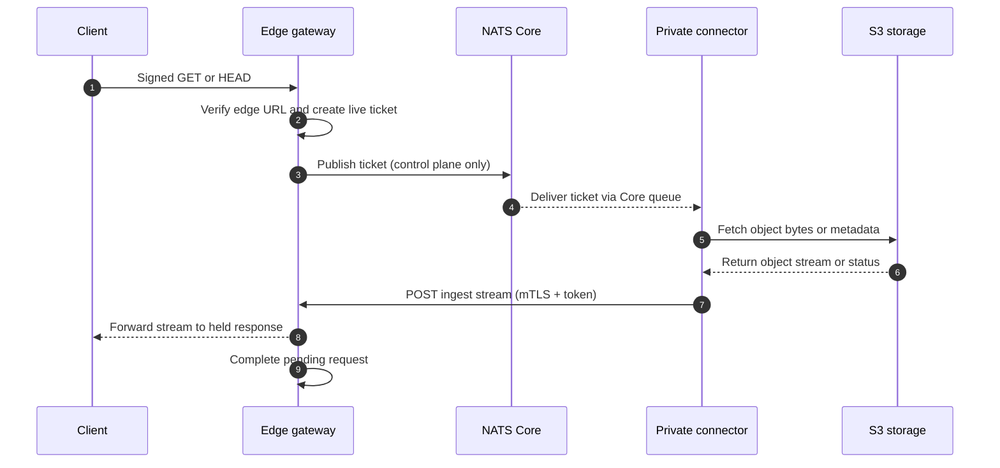
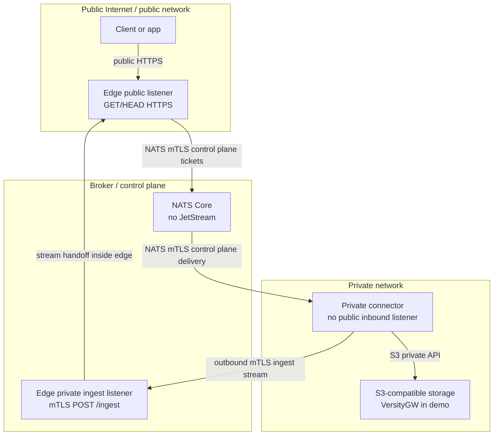

# air3: NATS S3 File Gateway

air3 is a file gateway that lets a public edge service coordinate signed object downloads with a private connector over NATS while keeping S3 credentials and object bytes out of the NATS control plane.

## Documentation

- [Architecture](docs/architecture.md)
- [Configuration](docs/configuration.md)

## Architecture constraints

- **NATS Core only:** air3 uses Core NATS publish/subscribe and queue groups; JetStream, durable streams, replay, and persistence are out of scope.
- **No object bytes through NATS:** NATS carries tickets and control metadata only. File content moves over the private S3 path and the connector-to-edge ingest stream.
- **Single edge gateway:** each public request is held by the edge gateway process that created it.
- **Connector-only S3 credentials:** the edge gateway has no S3 credentials and is not attached to the private S3 network in the Compose demo.
- **Edge signed URLs are not S3 presigned URLs:** they authorize the air3 edge gateway, not direct S3 API access.

## Request and stream flow



## Conceptual zones



## Components

- `cmd/edge-gateway`: public HTTPS entry point for signed `GET`/`HEAD` object requests and private mTLS ingest listener for connector responses.
- `cmd/private-connector`: private-side worker that receives NATS Core tickets, fetches from S3-compatible storage, and posts object bytes to the edge ingest listener.
- `cmd/signurl`: CLI utility for signing public object URLs.
- `internal/config`: environment configuration loading and validation.
- `internal/tickets`: transfer ticket models.
- `internal/signing`: signed URL HMAC creation and verification.
- `internal/mtls`: TLS and mTLS support.
- `internal/natsclient`: NATS Core client wiring.
- `internal/pending`: in-flight request tracking.
- `internal/ingest`: edge-side ingest coordination.
- `internal/s3fetch`: connector-side S3 object fetching.

## Docker Compose demo quickstart

Prerequisites:

- Go 1.22 or newer
- `make`
- Docker with the Compose plugin
- `openssl` for demo certificate generation
- `curl` for smoke tests

The demo starts four runtime services:

- `edge-gateway` on the `public` and `broker` networks, with public HTTPS exposed on <https://localhost:8443>.
- `private-connector` on the `broker` and `private` networks, with no host-published application port.
- `nats` on the `broker` network, using TLS/mTLS and NATS Core only.
- `versitygw` on the `private` network only, with no host-published S3 port.

Generated demo certificates live under `deploy/certs/generated/`, which is ignored by git.

Run the end-to-end demo:

```sh
make certs
make compose-up
make seed
make smoke
make compose-down
```

Or run the same sequence as one target:

```sh
make e2e
```

`make smoke` verifies:

- signed `GET` returns the seeded object content,
- signed `HEAD` succeeds without a response body,
- bad and expired signatures are rejected,
- missing objects map to `404`,
- connector downtime maps to a gateway timeout and fresh requests work after restart,
- the edge container cannot connect directly to `versitygw:10000`.

## Local validation

```sh
make fmt             # format Go code
make test            # run Go tests
make build           # build binaries into ./bin
make compose-config  # validate deploy/compose.yaml
make validate        # format, test all packages, build, and validate Compose config
make ts-test         # run TypeScript edge signing package tests
make python-test     # run Python edge signing package tests
go test ./... -race  # run race-enabled Go tests
```

If Docker is unavailable, `make validate` may fail at the final Compose config check after completing formatting, tests, and builds. `make compose-config` is the Docker-dependent portion.

## Edge signed URL packages

Applications can generate and verify air3 edge signed URLs from importable packages under `packages/`:

- Go: `packages/go/edgesign` (`github.com/terion-name/air3/packages/go/edgesign`)
- TypeScript: `packages/ts`, exporting pure functions from `src/index.ts`
- Python: `packages/python/edgesign`

These helpers create **edge gateway signed URLs**, not S3 SigV4 presigned URLs. The edge gateway verifies the HMAC signature before it publishes a NATS Core ticket for the private connector; the signed URL is never a direct S3 credential or S3 API authorization.

The signature covers these canonical newline-delimited fields: HTTP method, bucket, key, Unix expiration seconds, optional signed byte range, optional response content type, and optional response content disposition. If a public request sends a `Range` header while signing is enabled, that exact range must be included in the signed URL.

Go example:

```go
raw, err := edgesign.SignURL(edgesign.SignInput{
    Method:  "GET",
    BaseURL: "https://files.example.com",
    Bucket:  "demo-bucket",
    Key:     "dir/object.txt",
    Secret:  signingSecret,
    Expires: time.Now().Add(15 * time.Minute),
    Range:   "bytes=0-99", // optional
})
```

TypeScript example:

```ts
import { signUrl, verifyUrl } from './packages/ts/src/index.ts';

const raw = signUrl({
  method: 'GET',
  baseUrl: 'https://files.example.com',
  bucket: 'demo-bucket',
  key: 'dir/object.txt',
  secret: signingSecret,
  expires: Math.floor(Date.now() / 1000) + 900,
  range: 'bytes=0-99', // optional
});

const claims = verifyUrl({ method: 'GET', url: raw, secret: signingSecret, now: Date.now() / 1000 });
```

Python example:

```python
from datetime import datetime, timedelta, timezone
from edgesign import sign_url, verify_url

raw = sign_url(
    method="GET",
    base_url="https://files.example.com",
    bucket="demo-bucket",
    key="dir/object.txt",
    secret=signing_secret,
    expires=datetime.now(timezone.utc) + timedelta(minutes=15),
    range="bytes=0-99",  # optional
)

claims = verify_url(method="GET", url=raw, secret=signing_secret, now=datetime.now(timezone.utc))
```

## HTTP and Range behavior

Public object URLs support `GET` and `HEAD`. The gateway supports one HTTP byte range per request using standard `Range` forms such as `bytes=0-99`, `bytes=100-`, or `bytes=-100`. Multiple ranges and malformed ranges are rejected with `400 Bad Request` before a ticket is published.

When URL signing is enabled, a ranged request must include the range claim in the signed URL (`cmd/signurl -range 'bytes=0-99'`). If a client also sends a `Range` header, it must exactly match the signed range claim. The connector forwards accepted ranges to S3 and returns `206 Partial Content` metadata (`Content-Range`, `Accept-Ranges`) when the backend supplies it.

## Configuration

See [Configuration](docs/configuration.md) for environment variables, TLS/mTLS settings, timeout and allowlist behavior, and the Compose demo network model.

## Releases and images

Pushing a bare semver-like tag such as `0.0.1` runs the release workflow. The workflow tests the Go packages, validates the Compose file when Docker Compose is available, cross-compiles `edge-gateway`, `private-connector`, and `signurl` for Linux, macOS, and Windows on amd64 and arm64, uploads packaged artifacts, and publishes SHA-256 checksums.

The same release workflow publishes separate multi-architecture Linux images to GitHub Container Registry. Images are tagged with the release tag:

- `ghcr.io/terion-name/air3/edge-gateway:<tag>`
- `ghcr.io/terion-name/air3/private-connector:<tag>`
- `ghcr.io/terion-name/air3/signurl:<tag>`

Pull a released image with, for example:

```sh
docker pull ghcr.io/terion-name/air3/edge-gateway:0.0.1
docker pull ghcr.io/terion-name/air3/private-connector:0.0.1
docker pull ghcr.io/terion-name/air3/signurl:0.0.1
```

The root `Dockerfile` builds one selected binary into a small runtime image. Select the command with the `APP` build argument; supported values are `edge-gateway`, `private-connector`, and `signurl`. The selected binary is copied to `/usr/local/bin/air3`, which is the image default command.

```sh
docker build --build-arg APP=edge-gateway -t air3-edge-gateway:local .
docker build --build-arg APP=private-connector -t air3-private-connector:local .
docker build --build-arg APP=signurl -t air3-signurl:local .
```

The Compose demo sets `APP` per service and builds separate local images for `edge-gateway` and `private-connector`.
