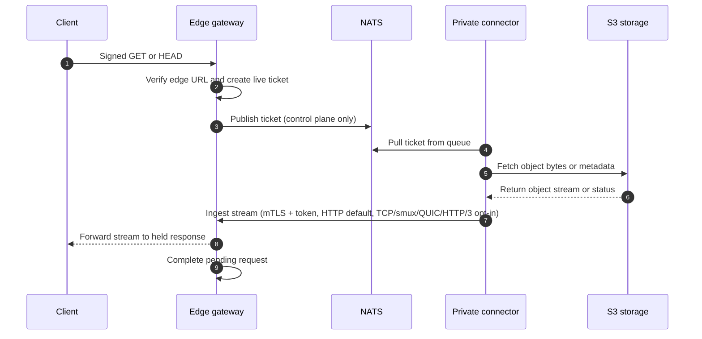
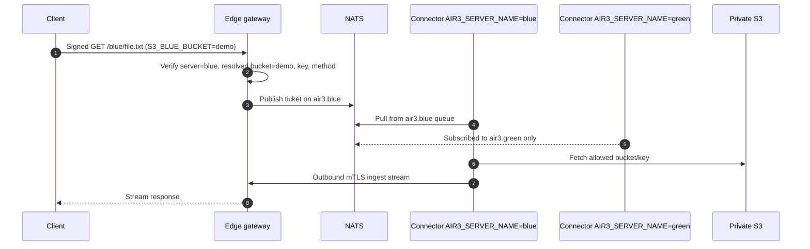
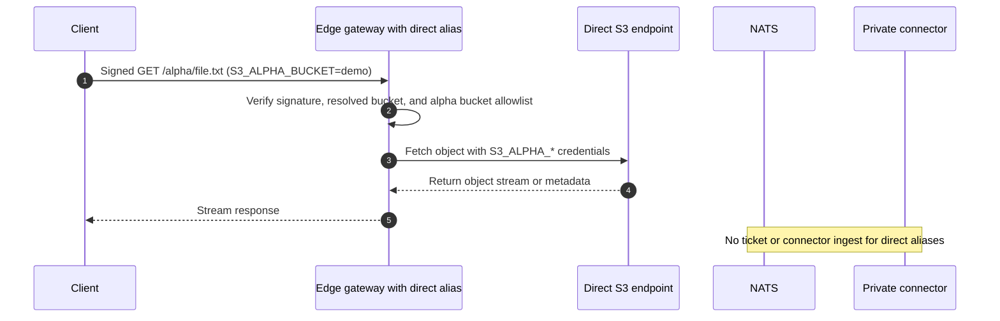
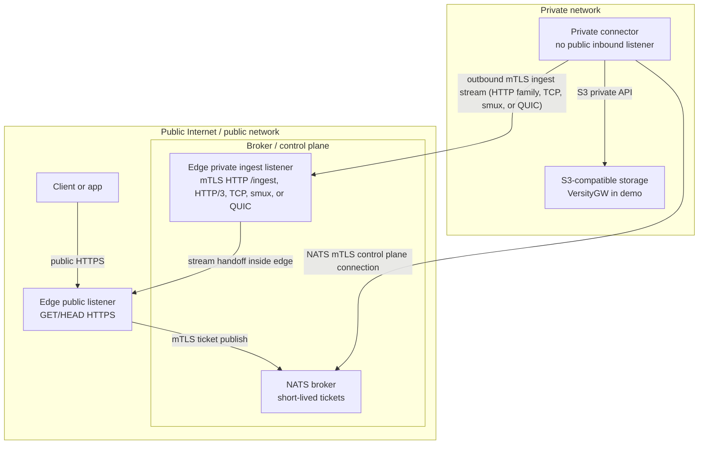

# Architecture Details

**air3** strictly separates your public edge from your private storage to keep your S3 credentials entirely safe.

The default and recommended architecture is built around the idea that **no inbound connections should ever reach your private network**, and your public-facing gateway should **never possess your S3 credentials**. Multi-server routing preserves that boundary by routing each server alias to a connector-specific NATS subject. Direct-server aliases are the explicit exception: they intentionally put selected S3 credentials and network reachability on the Edge.

## The Three Pillars

1. **Edge Gateway (Public & DMZ):** A lightweight server that sits on the edge. It listens for public HTTP `GET`/`HEAD` requests. It validates your signed URLs, creates a "ticket" for valid requests, and temporarily holds the client's HTTP connection open.
2. **NATS Broker (Control Plane):** A message broker that acts as the communication channel. The Edge publishes tickets to NATS.
3. **Private Connector (Private Network):** A worker that securely holds your S3 credentials. It has **no inbound listeners**. It connects outward to NATS to pull tickets, fetches the requested file from your S3 storage, and opens a secure outbound mTLS connection to the Edge Gateway's private "ingest" port to stream the file bytes back. HTTP ingest is the default; HTTP/3, TCP, smux, and custom QUIC ingest are experimental opt-in transports for benchmarking/tuning.

## Request and Stream Flow

In default single-server mode, tickets publish to `AIR3_NATS_SUBJECT` (default `air3.tickets`). Public URLs use legacy `/{bucket}/{key}` paths unless the Edge sets `AIR3_S3_BUCKET`; with `AIR3_S3_BUCKET=demo`, signed URLs generated with `cmd/signurl -default-bucket-path` can use short `/{key}` paths while signatures, tickets, and connector fetches still bind bucket `demo`. This is the normal isolated edge/NATS/connector/S3 topology.

- Object bytes are transferred over the Private Connector-to-S3 path and the Private Connector-to-Edge ingest stream. That ingest stream is HTTPS by default; experimental HTTP/3, TCP, smux, or custom QUIC ingest can be enabled explicitly without changing the control plane or public client URL behavior.
- The public client's response is held open by the Edge Gateway process until the Connector streams the data back.
- Tickets are in-memory items. If the edge restarts, or the connector cannot fetch the file in time, the held public request safely times out or fails.

When `AIR3_S3_BUCKET` is configured for single-server mode, short-form parsing wins. For example, `/demo/file.txt` means key `demo/file.txt` in default bucket `demo`, not key `file.txt`; leaving `AIR3_S3_BUCKET` unset preserves the legacy full-path interpretation. `AIR3_S3_BUCKET` is only a routing/signing default bucket name on the Edge, not an S3 credential.

## Advanced Routing: Multi-Server Flow

If you need to connect to multiple disparate S3 storage backends, you can enable Multi-Server mode (`AIR3_MULTI_SERVER=true`).

In this mode, URLs contain a **server alias** (e.g., `/blue/demo-bucket/file.txt`). The Edge Gateway dynamically derives a NATS subject from this alias (e.g., `air3.blue`). You run multiple Private Connectors, each configured with an `AIR3_SERVER_NAME` that tells it which queue to listen to. This allows the Edge to route requests to the correct storage backend seamlessly.

*(You can also configure default buckets per alias (`S3_BLUE_BUCKET=demo`), which shortens the public URL to `/blue/file.txt` while keeping the internal routing intact.)*

## Exception: Direct-Server Flow

Direct-server aliases (configured via `AIR3_DIRECT_SERVERS`) explicitly bypass NATS and the Private Connector entirely. The Edge Gateway fetches the object directly from the configured S3 endpoint.

**This is a significant security exception.** It requires the Edge Gateway to hold S3 credentials and have direct network reachability to the storage backend. This breaks the core isolation boundary of air3. Only use direct servers when you deliberately accept exposing those credentials to your DMZ.

## Security Boundaries & Conceptual Zones

We isolate infrastructure into three logical zones:

1. **Public Zone:** The wild internet and the public face of your Edge Gateway.
2. **Broker / Control Zone:** Where NATS lives, and where the Private Connector reaches out to talk to the Edge Gateway.
3. **Private Zone:** Completely isolated. Contains your actual S3 storage and the Private Connector.

### Key Security Benefits

- **S3 credentials stay private by default:** In the recommended connector-routed topology, the Edge Gateway has absolutely zero knowledge of `AIR3_S3_ACCESS_KEY_ID` and `AIR3_S3_SECRET_ACCESS_KEY`. If the Edge is compromised, the attacker still cannot access your connector-only S3 buckets. Direct-server aliases intentionally opt out for their configured `S3_{SUFFIX}_*` credentials.
- **Outbound-only application traffic:** The Private Connector has no open inbound ports. It only initiates connections *out* to NATS, S3, and the Edge's ingest endpoint.
- **Separate public and ingest listeners:** Public requests hit the public listener. The private ingest listener requires strict mTLS authentication *and* a one-time ingest token generated by the Edge. The experimental HTTP/3, TCP, smux, and custom QUIC ingest transports use the same mTLS files, connector identity allowlist, and one-time token semantics as the default HTTP ingest path.
- **Defense-in-depth allowlists:** Both the Edge and the Connector strictly validate allowed bucket names before taking any action. Direct-server aliases have their own Edge-enforced `S3_{SUFFIX}_ALLOWED_BUCKETS` allowlist, and any `S3_{SUFFIX}_BUCKET` default for a direct alias must be included in that allowlist.
- **Secret-safe logging:** Logs are designed to be safe to ship anywhere. They use request IDs and high-level outcomes—never logging HMAC secrets, full URLs, ingest tokens, or raw S3 credentials.

## Data Plane vs. Control Plane

| Plane | Path | Contains | Does not contain |
| --- | --- | --- | --- |
| Public data plane | Client to edge public listener | Public `GET`/`HEAD`, signed URL claims, optional short-form default-bucket paths, response bytes | S3 credentials |
| Control plane | Edge to NATS to connector | Request ID, method, optional server alias, bucket, key, range, deadline, HTTPS ingest URL/fallback, one-time ingest token | Object bytes / file data |
| Private data plane | Connector to S3 | S3 object fetch and metadata requests | Public client connection |
| Direct-server data plane | Edge to configured S3 endpoint | S3 requests using `S3_{SUFFIX}_*` credentials for opt-in direct aliases | NATS tickets / Private Connector path |
| Ingest data plane | Connector to edge ingest listener (HTTP default; HTTP/3, TCP/smux, or QUIC experimental opt-in) | Object stream, safe response metadata, request ID, ingest token | Public client connection |

## Operational behavior

- NATS exclusively carries short-lived fetch tickets and control messages for connector-routed aliases. Queue-group semantics are unchanged: a ticket is delivered to one connector replica, and each connector uses a bounded local worker pool (`AIR3_CONNECTOR_WORKERS`) for concurrent ticket handling.
- In single-server mode, `AIR3_S3_BUCKET` enables default-bucket short paths `/{key}`; the resolved bucket is still included in signed URL validation and connector-routed tickets.
- With `AIR3_MULTI_SERVER=true`, the Edge parses `/{server}/{bucket}/{key}` or, for aliases with `S3_{SUFFIX}_BUCKET`, short-form `/{server}/{key}` paths. It publishes connector-routed tickets to `AIR3_NATS_SUBJECT_TEMPLATE` (default `air3.{server}`). Connectors set `AIR3_SERVER_NAME` to derive their subscription subject and reject mismatched tickets.
- Direct-server aliases configured with `AIR3_DIRECT_SERVERS`/`DIRECT_SERVERS` bypass NATS and connector ingest for those aliases; the Edge enforces the direct alias bucket allowlist, validates any direct default bucket against that allowlist, and fetches from S3 itself.
- Signatures bind the resolved server, bucket, and key. Omitting a configured default bucket from the public URL does not make the bucket implicit in the signature or ticket; tampering with the server alias, key, or resolved bucket still fails validation.
- `AIR3_INGEST_URL` remains the HTTPS ingest fallback/ticket URL in all modes and is used directly by the HTTP-family transports (`http`, `http1`, `http2`, `http3`) with the existing headers and body.
- Custom stream transports (`tcp`, `smux`, `quic`) use the shared MessagePack metadata frame, raw object body, and ack semantics. `smux` multiplexes those streams over persistent mTLS TCP, with one smux stream per object; direct `quic` uses `AIR3_EDGE_INGEST_QUIC_ADDR`/`AIR3_INGEST_QUIC_ADDR`.
- The Edge Gateway holds the pending client response until the Connector finishes fetching the object.
- If any internal piece (Connector, NATS, S3) goes down, the Edge cleanly returns a standard HTTP error to the client (`503 Service Unavailable` or `504 Gateway Timeout`).
- Edge signed URLs only authorize requests against the air3 gateway itself. They are absolutely not S3 credentials and can never be reused against your direct S3 API.
- The optional read-only S3-compatible API is disabled by default. When enabled, `AIR3_S3_API_*` credentials verify AWS SigV4-shaped public requests at the Edge only; they are separate from backend S3 credentials, direct-server credentials, and Air3 HMAC signed URL secrets. The v1 API is path-style only and supports only `GetObject`, `HeadObject`, `HeadBucket` validation, and `ListObjectsV2`.
