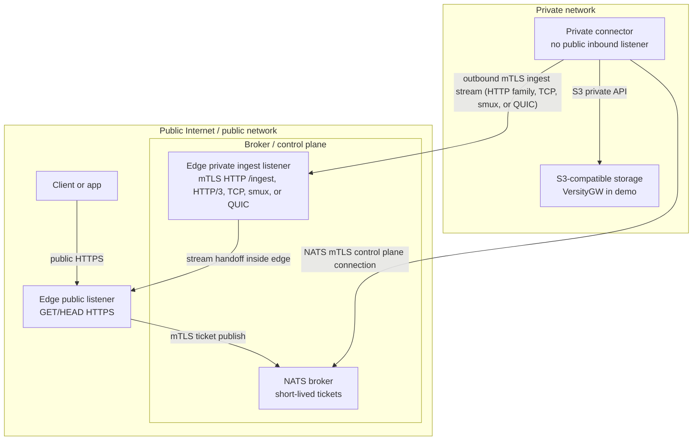

# Architecture Details

**air3** strictly separates your public edge from your private storage to keep your S3 credentials entirely safe.

The architecture is built around the idea that **no inbound connections should ever reach your private network**, and your public-facing gateway should **never possess your S3 credentials**.

## The Three Pillars

1. **Edge Gateway (Public & DMZ):** A lightweight server that sits on the edge. It listens for public HTTP `GET`/`HEAD` requests. It validates your signed URLs, creates a "ticket" for valid requests, and temporarily holds the client's HTTP connection open.
2. **NATS Broker (Control Plane):** A message broker that acts as the communication channel. The Edge publishes tickets to NATS.
3. **Private Connector (Private Network):** A worker that securely holds your S3 credentials. It has **no inbound listeners**. It connects outward to NATS to pull tickets, fetches the requested file from your S3 storage, and opens a secure outbound mTLS connection to the Edge Gateway's private "ingest" port to stream the file bytes back. HTTP ingest is the default; HTTP/3, TCP, smux, and custom QUIC ingest are experimental opt-in transports for benchmarking/tuning.

## Request and Stream Flow

- Object bytes are transferred over the Private Connector-to-S3 path and the Private Connector-to-Edge ingest stream. That ingest stream is HTTPS by default; experimental HTTP/3, TCP, smux, or custom QUIC ingest can be enabled explicitly without changing the control plane or public client URL behavior.
- The public client's response is held open by the Edge Gateway process until the Connector streams the data back.
- Tickets are in-memory items. If the edge restarts, or the connector cannot fetch the file in time, the held public request safely times out or fails.

```mermaid
sequenceDiagram
    autonumber
    participant Client
    participant Edge as Edge gateway
    participant NATS as NATS
    participant Connector as Private connector
    participant S3 as S3 storage

    Client->>Edge: Signed GET or HEAD
    Edge->>Edge: Verify edge URL and create live ticket
    Edge->>NATS: Publish ticket (control plane only)
    Connector->>NATS: Pull ticket from queue
    Connector->>S3: Fetch object bytes or metadata
    S3-->>Connector: Return object stream or status
    Connector->>Edge: Ingest stream (mTLS + token; HTTP default, TCP/smux/QUIC/HTTP/3 opt-in)
    Edge-->>Client: Forward stream to held response
    Edge->>Edge: Complete pending request
```

## Security Boundaries & Conceptual Zones

We isolate infrastructure into three logical zones:

1. **Public Zone:** The wild internet and the public face of your Edge Gateway.
2. **Broker / Control Zone:** Where NATS lives, and where the Private Connector reaches out to talk to the Edge Gateway.
3. **Private Zone:** Completely isolated. Contains your actual S3 storage and the Private Connector.



### Key Security Benefits

- **S3 credentials stay private:** The Edge Gateway has absolutely zero knowledge of `AIR3_S3_ACCESS_KEY_ID` and `AIR3_S3_SECRET_ACCESS_KEY`. If the Edge is compromised, the attacker still cannot access your S3 buckets.
- **Outbound-only application traffic:** The Private Connector has no open inbound ports. It only initiates connections *out* to NATS, S3, and the Edge's ingest endpoint.
- **Separate public and ingest listeners:** Public requests hit the public listener. The private ingest listener requires strict mTLS authentication *and* a one-time ingest token generated by the Edge. The experimental HTTP/3, TCP, smux, and custom QUIC ingest transports use the same mTLS files, connector identity allowlist, and one-time token semantics as the default HTTP ingest path.
- **Defense-in-depth allowlists:** Both the Edge and the Connector strictly validate allowed bucket names before taking any action.
- **Secret-safe logging:** Logs are designed to be safe to ship anywhere. They use request IDs and high-level outcomes—never logging HMAC secrets, full URLs, ingest tokens, or raw S3 credentials.

## Data Plane vs. Control Plane

| Plane | Path | Contains | Does not contain |
| --- | --- | --- | --- |
| Public data plane | Client to edge public listener | Public `GET`/`HEAD`, signed URL claims, response bytes | S3 credentials |
| Control plane | Edge to NATS to connector | Request ID, method, bucket, key, range, deadline, HTTPS ingest URL/fallback, one-time ingest token | Object bytes / file data |
| Private data plane | Connector to S3 | S3 object fetch and metadata requests | Public client connection |
| Ingest data plane | Connector to edge ingest listener (HTTP default; HTTP/3, TCP/smux, or QUIC experimental opt-in) | Object stream, safe response metadata, request ID, ingest token | Public client connection |

## Operational behavior

- NATS exclusively carries short-lived fetch tickets and control messages. `AIR3_INGEST_URL` remains the HTTPS ingest fallback/ticket URL in all modes and is used directly by the HTTP-family transports (`http`, `http1`, `http2`, `http3`) with the existing headers and body.
- Custom stream transports (`tcp`, `smux`, `quic`) use the shared MessagePack metadata frame, raw object body, and ack semantics. `smux` multiplexes those streams over persistent mTLS TCP, with one smux stream per object; direct `quic` uses `AIR3_EDGE_INGEST_QUIC_ADDR`/`AIR3_INGEST_QUIC_ADDR`.
- The Edge Gateway holds the pending client response until the Connector finishes fetching the object.
- If any internal piece (Connector, NATS, S3) goes down, the Edge cleanly returns a standard HTTP error to the client (`503 Service Unavailable` or `504 Gateway Timeout`).
- Edge signed URLs only authorize requests against the air3 gateway itself. They are absolutely not S3 credentials and can never be reused against your direct S3 API.
