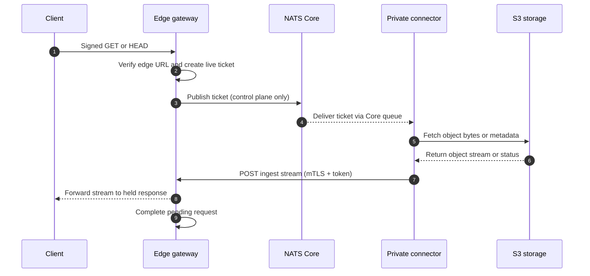
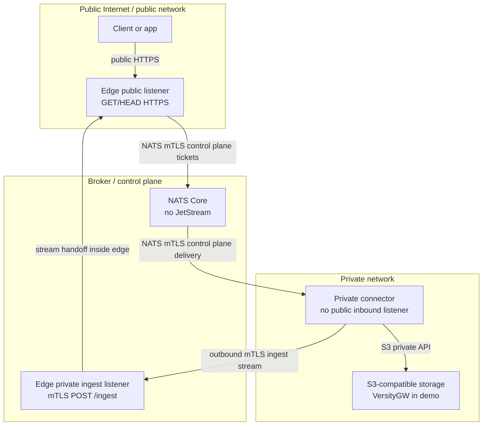

# air3 architecture

air3 exposes selected private S3-compatible objects through an edge gateway without putting S3 credentials, the S3 service, or object bytes on the public edge control plane.

The runtime has three main pieces:

- **Edge gateway**: a single edge instance with a public `GET`/`HEAD` listener and a private mTLS ingest listener. It validates air3 edge signed URLs, creates live in-memory tickets, publishes those tickets to NATS Core, and holds the client response until the connector streams back.
- **NATS Core broker**: the control plane for small transfer tickets. air3 does not use JetStream, persistence, replay, or object byte transport through NATS.
- **Private connector**: a private-side worker with S3 credentials. It receives tickets over NATS, fetches object bytes from S3-compatible storage, and makes an outbound mTLS `POST /ingest` stream to the edge ingest listener. It has no public inbound application listener.

Edge signed URLs are air3 HMAC URLs. They are **not** S3 SigV4 presigned URLs and do not authorize direct S3 API access.

## Request and stream flow

Key points:

- Object bytes travel over the connector-to-S3 path and the connector-to-edge ingest stream, never through NATS.
- The public client response is held by the same edge gateway process that created the ticket.
- Tickets are live, in-memory work items. If the edge restarts, NATS is unavailable, no connector handles the ticket, or the ingest stream misses the pending TTL, the public request fails instead of being replayed later.

## Conceptual zones

In the Compose demo, the `public`, `broker`, and `private` networks are separate. The edge gateway joins `public` and `broker`, NATS joins `broker`, the connector joins `broker` and `private`, and VersityGW joins only `private`.

## Security boundaries

- **No S3 credentials on edge**: only the private connector configures `AIR3_S3_ACCESS_KEY_ID` and `AIR3_S3_SECRET_ACCESS_KEY`. The edge gateway does not need the private S3 endpoint and is not attached to the private S3 network in the demo.
- **Connector has no public app listener**: clients never call the connector directly. The connector initiates outbound connections to NATS, S3, and the edge ingest endpoint.
- **Separate public and ingest listeners**: public object requests arrive on the edge public listener. Connector object streams arrive on the edge ingest listener and require mTLS plus a one-time ingest token.
- **Defense-in-depth allowlists**: the edge validates allowed buckets before publishing a ticket, and the connector validates allowed S3 buckets before fetching.
- **Secret-safe logging expectation**: logs should use request IDs and high-level outcomes, not HMAC secrets, full signed URLs, ingest tokens, S3 credentials, or raw untrusted headers.

## Data plane vs. control plane

| Plane | Path | Contains | Does not contain |
| --- | --- | --- | --- |
| Public data plane | Client to edge public listener | Public `GET`/`HEAD`, signed URL claims, response bytes | S3 credentials |
| Control plane | Edge to NATS to connector | Request ID, method, bucket, key, range, deadline, ingest URL, one-time ingest token | Object bytes, S3 credentials |
| Private data plane | Connector to S3 | S3 object fetch and metadata requests | Public client connection |
| Ingest data plane | Connector to edge ingest listener | Object stream, safe response metadata, request ID, ingest token | NATS messages |

## Operational constraints

- NATS is Core-only. There are no streams, JetStream persistence, durable queues, or ticket replay.
- The edge gateway is single-instance. A pending client response belongs to the edge process that created it.
- Timeout behavior is expected: unavailable connector, NATS, S3, or ingest paths produce mapped public errors such as `503 Service Unavailable` or `504 Gateway Timeout`.
- Edge signed URLs authorize the edge gateway request only. They are not direct credentials for S3.
